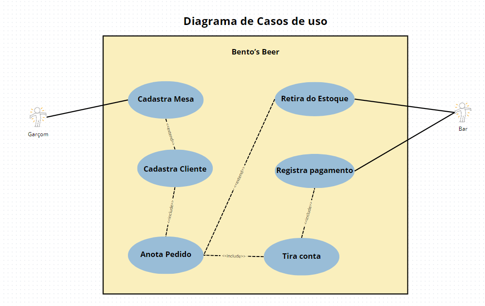
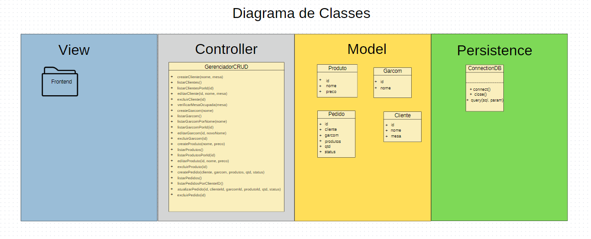
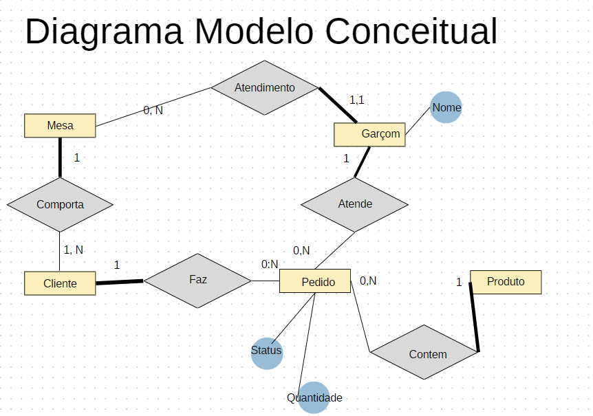
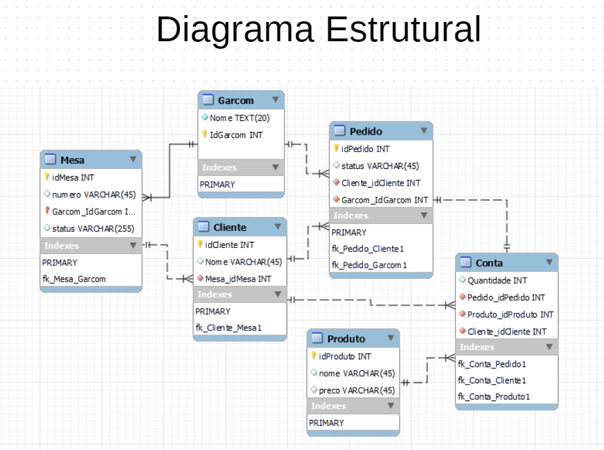

# Bento's Beer
O Bento's Beer é um programa _open source_ de software que permite o gerenciamento de clientes, mesas, pagamento, pedidos, produtos, estoque e outras instâncias pertencentes a um bar(ver  diagramas).
## Como Funciona
à base de uma arquitetura Cliente-Servidor. O Servidor hospeda o banco de dados, e executa o servidor. Do lado do cliente(que são os usuários) basta conectar-se via http.
## Como Executar?
Certifique-se de que já tenha instalado o Node.js e o banco de dados MySQL na sua máquina Servidor.
### Configurando o Banco de Dados
```sh
# No diretório onde está o arquivo binário MySQL digite o seguinte comando:
~$ mysql -u root -h localhost -p
```
Assim, você entrará no Sistema de Gerenciamento de Banco de Dados MySQL. Então digite o seguinte comando:
```sh
CREATE USER 'novo_usuario'@'localhost' IDENTIFIED BY '1234';
```
Substitua 'novo_usuario' por algum nome de usuário de sua preferência.
Depois, você deve entrar no repositório BentosBeer e baixar o arquivo infra/config.sql
Copiar os comandos que estão no arquivo e executar no MySQL.
Quando terminar, executar os seguitnes comandos no MySQL:
´´´sh
GRANT ALL PRIVILEGES ON BentosBeer.* TO 'novo_usuario'@'localhost';
FLUSH PRIVILEGES;
EXIT;
´´´
Por fim, localize o diretório do BentosBeer e execute os seguintes comandos:
```sh
# No diretório BentosBeer:
~$ npm install mysql2
~$ node server.js
```

### Ambiente de desenvolvimento:
 - Visual Studio Code

### UML
#### Diagrama de Casos de Uso:

#### Diagrama de Classes:

#### Diagrama Modelo Conceitual

#### Diagrama Estrutural

