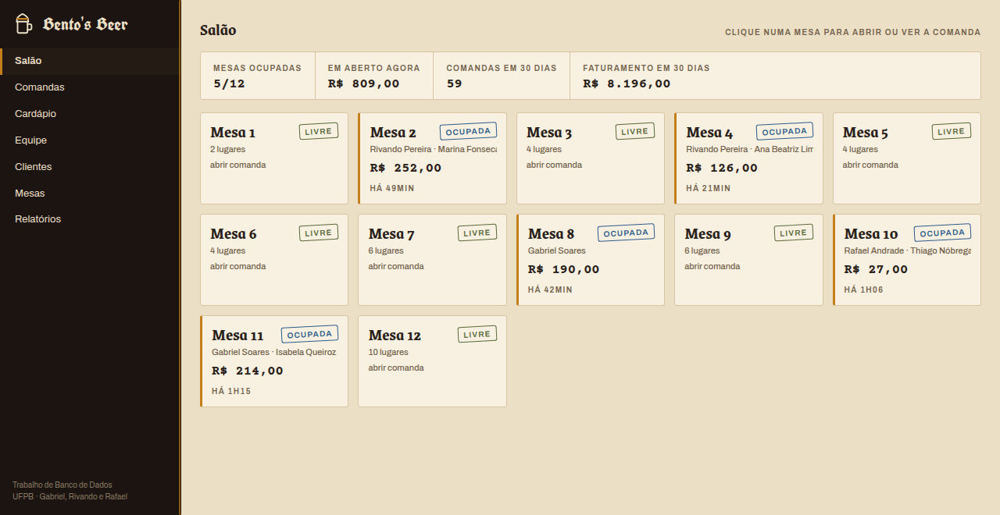
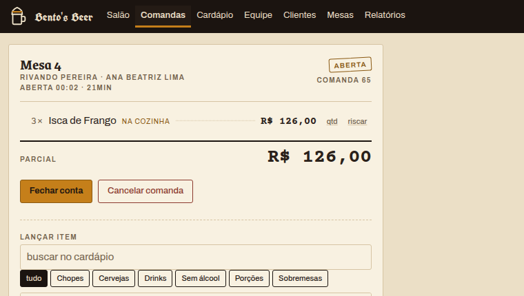
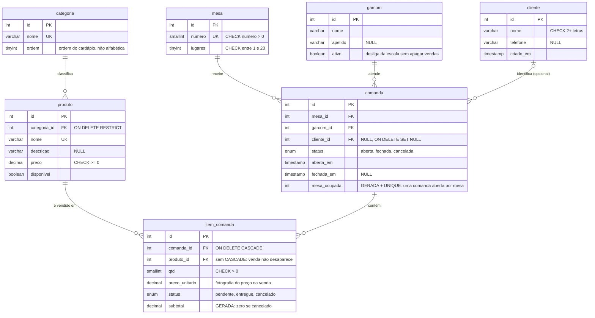
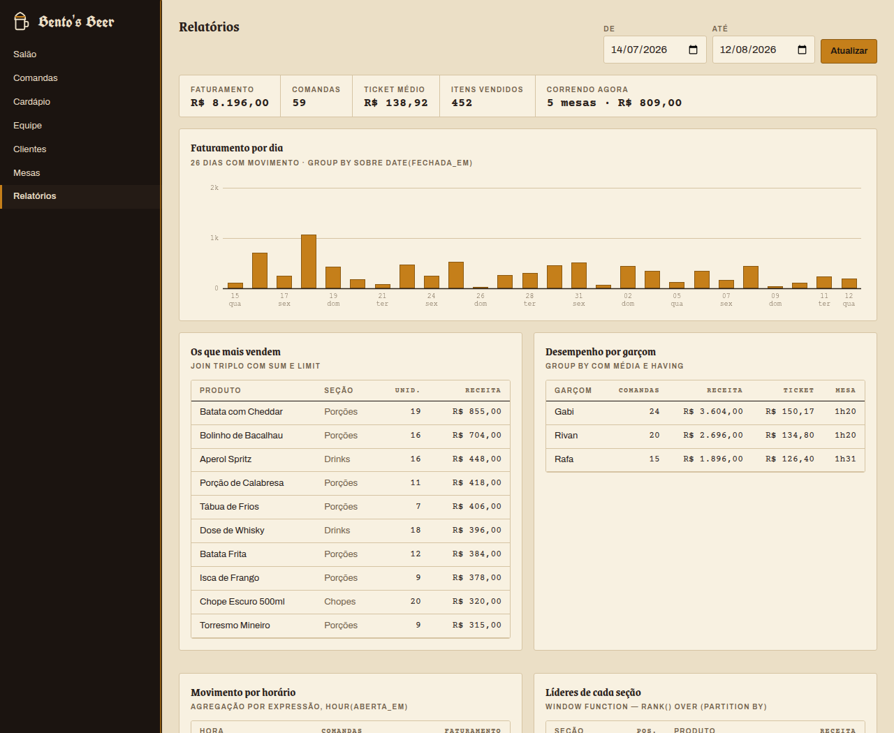

# Bento's Beer

Sistema de gerenciamento de bar — trabalho da disciplina de **Banco de Dados**, UFPB.
Autores: **Gabriel, Rivando e Rafael**.

Um bar não vende produto para cliente: vende itens dentro de uma **comanda** aberta em uma mesa,
atendida por um garçom, que em algum momento fecha. O sistema é construído em volta dessa entidade,
e a regra de negócio mora no banco — `CHECK`, `ENUM`, coluna gerada com `UNIQUE`, `VIEW`, `TRIGGER`
e uma `PROCEDURE` transacional.



---

## Rodar em quatro comandos

```bash
cp .env.example .env     # ajuste se for usar um MySQL 8 próprio
npm install              # 4 dependências: express, cors, mysql2, dotenv
npm run db:up            # sobe MySQL 8.4 em container e espera ficar saudável
npm run db:reset         # schema, views, triggers, procedure e dados de demonstração
npm start                # http://localhost:3000
```

Não usa Docker? Aponte o `.env` para a sua instância MySQL 8 e pule o `db:up` — nenhuma linha de
código muda.

| Comando | O que faz |
|---|---|
| `npm start` | sobe o servidor em `localhost:3000` |
| `npm run db:reset` | derruba, recria e popula o banco (roda quantas vezes quiser) |
| `npm test` | 69 testes de integração contra o banco `bentosbeer_test` |
| `bash docs/smoke.sh` | percorre o fluxo inteiro de uma comanda por curl |
| `npm run db:up` / `db:down` | liga e desliga o container do MySQL |

**Requisitos:** Node 18+ e MySQL 8 (ou Docker).

---

## O que o sistema faz

| Tela | Para quê |
|---|---|
| **Salão** | grade de mesas com status, quem atende e há quanto tempo. Abre e consulta comanda sem trocar de tela |
| **Comandas** | lista por status, com total e tempo de mesa |
| **Cardápio** | produtos por seção; esgotado sai do cardápio sem ser apagado |
| **Equipe** | garçons e quantas comandas cada um tem abertas agora |
| **Clientes** | cadastro com histórico de visitas e consumo |
| **Mesas** | o salão físico |
| **Relatórios** | seis consultas, com período ajustável e gráfico em `<canvas>` |

<p align="center">
  
</p>

A comanda é o elemento assinatura da interface: quantidade em monoespaçada, nome do item, pontilhado
preenchendo o vão, valor à direita, traço de 2px e o total embaixo. Item riscado continua na lista
com "cancelado" no lugar do valor — o bar não apaga, o bar risca.

---

## Modelo de dados

Sete tabelas, duas views, dois triggers, uma procedure. O arquivo comentado regra por regra é
[`db/01_schema.sql`](db/01_schema.sql).


```mermaid
erDiagram
    categoria ||--o{ produto : "classifica"
    produto   ||--o{ item_comanda : "é vendido em"
    comanda   ||--o{ item_comanda : "contém"
    mesa      ||--o{ comanda : "recebe"
    garcom    ||--o{ comanda : "atende"
    cliente   |o--o{ comanda : "identifica (opcional)"

    mesa {
        int      id PK
        smallint numero UK "CHECK numero > 0"
        tinyint  lugares "CHECK entre 1 e 20"
    }
    cliente {
        int       id PK
        varchar   nome "CHECK 2+ letras"
        varchar   telefone "NULL"
        timestamp criado_em
    }
    garcom {
        int     id PK
        varchar nome
        varchar apelido "NULL"
        boolean ativo "desliga da escala sem apagar vendas"
    }
    categoria {
        int     id PK
        varchar nome UK
        tinyint ordem "ordem do cardápio, não alfabética"
    }
    produto {
        int     id PK
        int     categoria_id FK "ON DELETE RESTRICT"
        varchar nome UK
        varchar descricao "NULL"
        decimal preco "CHECK >= 0"
        boolean disponivel
    }
    comanda {
        int       id PK
        int       mesa_id FK
        int       garcom_id FK
        int       cliente_id FK "NULL, ON DELETE SET NULL"
        enum      status "aberta, fechada, cancelada"
        timestamp aberta_em
        timestamp fechada_em "NULL"
        int       mesa_ocupada "GERADA + UNIQUE: uma comanda aberta por mesa"
    }
    item_comanda {
        int       id PK
        int       comanda_id FK "ON DELETE CASCADE"
        int       produto_id FK "sem CASCADE: venda não desaparece"
        smallint  qtd "CHECK > 0"
        decimal   preco_unitario "fotografia do preço na venda"
        enum      status "pendente, entregue, cancelado"
        decimal   subtotal "GERADA: zero se cancelado"
    }
```

### As três decisões que sustentam o modelo

**1. Uma comanda aberta por mesa, garantida pelo banco.**
A coluna gerada `mesa_ocupada` carrega o `mesa_id` **enquanto** a comanda está aberta, e `NULL` em
qualquer outro status. Como `NULL` não colide em índice único, um `UNIQUE` sobre ela permite cem
comandas no histórico da mesa e no máximo uma aberta agora — no `INSERT` **e** no `UPDATE`, para
qualquer cliente que se conecte ao banco. A versão anterior fazia essa checagem na aplicação, e só
na criação: editar uma comanda escapava da regra.

**2. Preço congelado no item.**
`item_comanda.preco_unitario` é uma fotografia, não repetição. Reajuste de cardápio amanhã não pode
reescrever o valor da venda de hoje. O servidor copia o preço dentro do próprio `INSERT ... SELECT`,
então o valor nunca vem do cliente.

**3. Subtotal como coluna gerada.**
`IF(status='cancelado', 0, qtd * preco_unitario)`, calculado uma vez no banco. Assim a procedure de
fechamento, as duas views e os seis relatórios usam exatamente a mesma regra, em vez de cada consulta
repetir o `IF` e uma delas esquecer.

---

## Relatórios

Seis consultas, isoladas em [`docs/consultas.sql`](docs/consultas.sql) para rodar no Workbench.

| # | Pergunta | Recurso de SQL |
|---|---|---|
| 1 | Faturamento por dia | `GROUP BY` sobre `DATE()` |
| 2 | Os que mais vendem | `JOIN` triplo, `SUM`, `LIMIT` |
| 3 | Desempenho por garçom | `GROUP BY`, média, `HAVING` |
| 4 | Movimento por horário | agregação por expressão, `HOUR()` |
| 5 | Líder de cada seção | `RANK() OVER (PARTITION BY … ORDER BY …)` |
| 6 | Salão agora | `VIEW` sobre `LEFT JOIN` |

**Dinheiro é somado em SQL, nunca em JavaScript.** `DECIMAL` chega ao driver como string justamente
para não perder centavo; somar com `reduce` desfaz essa proteção. A conversão para número acontece na
última linha antes do JSON.



---

## Como está organizado

```
db/     01_schema.sql · 02_seed.sql · reset.js
src/    server.js · app.js
        db/pool.js          pool, transação, conexão dedicada
        http/               validador próprio, AppError, fábrica de CRUD
        repos/              todo o SQL vive aqui, um arquivo por tabela
        routes/             sem SQL, sem try/catch
public/ o único diretório servido estaticamente
tests/  69 testes de integração
docs/   consultas.sql · smoke.sh · roteiro-demo.md · decisoes.md
```

Quatro dependências: `express`, `cors`, `mysql2`, `dotenv`. Sem ORM, sem framework de frontend, sem
bundler, sem TypeScript. Zero dependências de desenvolvimento — `node --test` é nativo.

Erro tratado em um lugar só: repositórios e rotas apenas lançam `AppError`, e um middleware final
traduz 21 códigos do MySQL para mensagem de usuário. `ER_DUP_ENTRY` no índice `uq_mesa_ocupada` vira
*"Essa mesa já tem uma comanda aberta."*; detalhe técnico nunca vaza, vai para o log com um id de
correlação.

As decisões tomadas ao longo do caminho — incluindo as divergências encontradas na especificação —
estão em [`docs/decisoes.md`](docs/decisoes.md).

---

## Fora do escopo

Declarado, não esquecido: autenticação, pagamento, impressão fiscal, controle de estoque, uso
simultâneo por várias pessoas e deploy. O alvo é uma estação de trabalho local.

---

## Nota de segurança sobre o histórico do Git

Commits anteriores a esta reconstrução contêm **senhas de banco em texto claro** — o antigo
`ConnectionDB.js` trazia a credencial hardcoded. O histórico **não foi reescrito**, por decisão
consciente, para não invalidar a tag da entrega original nem links de commit já compartilhados.

As credenciais expostas **foram invalidadas** e não abrem mais nenhum banco. Da v2 em diante,
credencial existe só no `.env`, que está no `.gitignore`; o repositório carrega apenas o
`.env.example`.

A versão originalmente entregue na disciplina está preservada na tag
[`v1-entrega-antiga`](../../tree/v1-entrega-antiga), e o diagnóstico do que ela tinha de bom e de
ruim está em [`docs/diagnostico-v1.md`](docs/diagnostico-v1.md).

---

<sub>

**Sobre o nome.** "Bento's Beer" é piada com o Papa Bento XVI, bávaro de Marktl am Inn, região onde
cervejaria é assunto sério — existe uma foto conhecida dele erguendo uma caneca de chope no
aniversário de 90 anos, em 2017. O ícone do sistema é a piada desenhada em vez de fotografada: uma
caneca cuja espuma tem a silhueta de uma mitra papal, com a faixa em âmbar. Sem foto, por dois
motivos práticos — direito de imagem, e porque fotografia vira mancha ilegível em favicon de 16px.

</sub>
